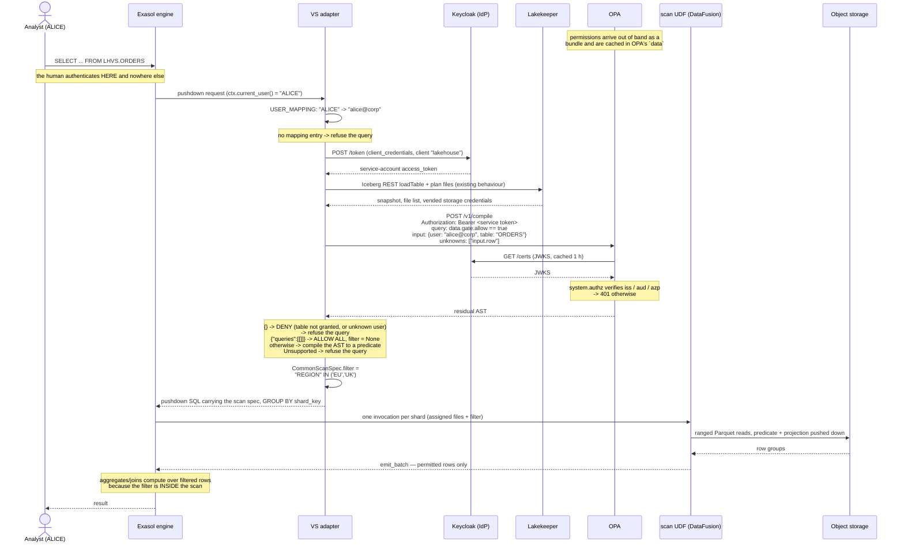
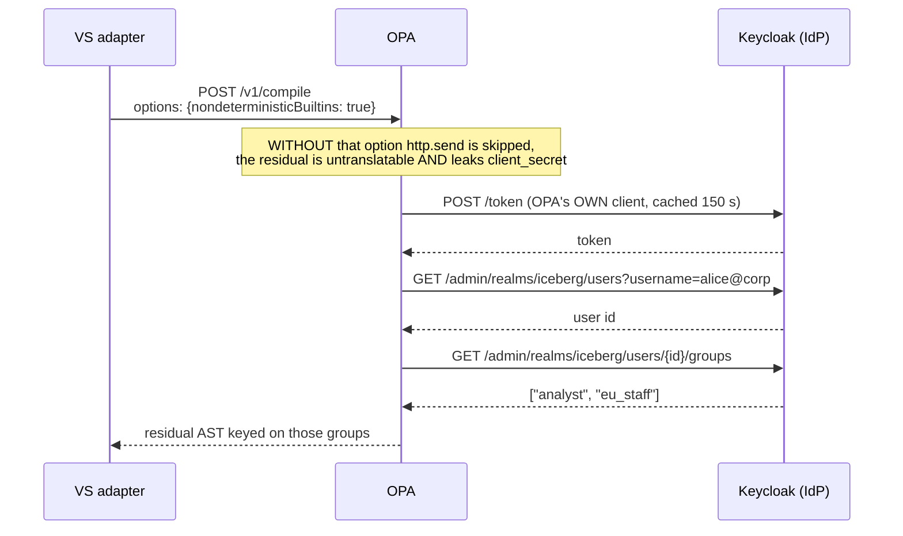

# Spike: can OPA enforce row-level access in lakehouse-engine using only the Exasol user name?

**Verdict: yes.** Build a layer that compiles OPA's partial-evaluation output into a DataFusion
predicate. Do not use the SQL-string contract Trino's plugin uses.

This README covers five passes.

**Pass 1** followed the brief's prior art, Trino's `trino-opa` plugin, in which OPA returns a SQL
expression *string*. That contract fails here: **0 of 9** realistic row filters planned in the
engine's DataFusion verbatim, 5 of 9 after an identifier rewrite, and the residue includes silent
wrong answers (Trino's own documented column-mask example returns the **unmasked** value). Worse, an
unknown user, a mistyped policy path and a crashed policy all answer HTTP 200 meaning "unrestricted".
Sections [1](#1-what-exactly-does-opa-return) to [6](#6-cost) are that pass, and they remain the
reason not to copy Trino's design.

**Pass 3** ([§9](#9-authentication-sharing-lakekeepers-idp)) answers the authentication question:
OPA runs against the **same Keycloak realm** the catalog uses, the engine presents the **same
client-credentials token** to both, and OPA resolves the querying user's **groups from that same
IdP**. All three verified live. One trap: partial evaluation does not run `http.send` unless asked,
and the default leaves the IdP calls unresolved *and* leaks the client secret into the output.

**Pass 2** ([§8](#8-the-mechanism-pass-1-missed-opa-partial-evaluation)) tests the mechanism pass 1
missed, and it is the one to build on. OPA's Compile API (`POST /v1/compile`) partial-evaluates a
policy with the table row declared *unknown* and returns the residual conditions as a **structured
AST**, not a string. A 230-line translation layer written for this spike compiles that AST into a
DataFusion predicate, and the compiled output plans, returns the correct rows, and gives identical
answers sharded and single-node. The AST also distinguishes allow-all from deny-all from
filter, which is exactly the fail-open hole pass 1 found and could not close.

**Pass 4** ([§10](#10-opa-does-both-the-table-gate-and-the-row-filter)-[§13](#13-parked-a-lakekeeper-grant-table-gate))
settles the scope. **OPA answers both questions in one call**: an ungranted table makes the residual
`{}`, which is DENY, so coarse-grain table access is the degenerate case of the row filter rather
than a second mechanism. That collapses the design to **one external dependency** and makes
`USER_MAPPING` trivial — it maps the Exasol user name to whatever key the policy is keyed on, with no
prefix and no IdP subject to discover. A Lakekeeper-grant table gate also works and is verified live,
but it is strictly weaker (no rows, no columns), needs a second identity namespace, needs the OpenFGA
backend, and is not an enforcement point anyway; it is **parked** as a possible separate feature for
a deployment without OPA.

**Pass 5** ([§15](#15-correction-use-a-uri-and-the-ucast-target)) corrects pass 2 on one point that
changes the implementation. The Compile API has a second route, `POST /v1/compile/<policy path>`,
where an `Accept` header selects a **target** — and OPA 1.20.2 open-source returns **UCAST**,
dialect-neutral structured JSON, on it. Pass 2 tested the target header on the body-query route,
where it is ignored, and wrongly concluded the build had no targets. Consequences: the endpoint is
**one URI** (so no separate policy-path property), and the thing to translate is **UCAST**, not the
raw AST — typed numbers, no injection surface at all, a wider operator fragment, and OPA naming its
own refusals. The SQL targets are still the wrong choice: no DataFusion dialect, and a numeric
literal comes out as a string.

So: the feature is real, OPA is the right tool, and **Rego is never translated**. It is evaluated;
what gets translated is the expression tree OPA hands back.

Everything below is backed by a transcript in `evidence/` or a quoted source file. Where something
was reasoned about rather than executed it says so explicitly.

Tracked property this spike relies on and did **not** re-verify: a user holding only
`CREATE SESSION` plus `SELECT` on the virtual schema can run queries and `EXPLAIN VIRTUAL` but
cannot execute the captured pushdown SQL ("insufficient privileges for calling script"), so an
adapter-injected filter cannot be stripped by the user. GitHub issue #402.

## Reproducing

```bash
scripts/run-all.sh          # everything; downloads OPA into .bin/ (gitignored)
scripts/10-capture-row-filters.sh
scripts/20-capture-column-masks.sh
scripts/30-failure-modes.sh
scripts/40-latency.sh
scripts/50-translate-probe.sh          # cargo; df-probe/ is NOT a workspace member
scripts/60-exasol-identity.sh          # needs: docker compose up -d exasol
scripts/70-partial-evaluation.sh       # pass 2: the Compile API
scripts/80-compile-probe.sh            # pass 2: AST -> DataFusion, executed
scripts/85-ucast-target.sh             # pass 5: the path route, UCAST vs SQL targets
scripts/90-idp-auth.sh                 # pass 3: shared IdP; needs Keycloak, see header
scripts/95-per-user-data.sh            # per-user permissions as plain OPA data
scripts/97-lakekeeper-table-grants.sh  # per-table grants; needs the OpenFGA overlay, see header
scripts/96-table-gate.sh               # table gate + row filter from ONE policy and ONE call
scripts/98-user-id-namespace.sh        # what the Lakekeeper user id is made of; no minio needed
```

| Evidence | What it holds |
|---|---|
| `evidence/00-trino-contract.txt` | Verbatim Trino source excerpts defining the request/response types |
| `evidence/01-row-filters.txt` | 12 live `GetRowFilters` request/response pairs from OPA 1.20.2 |
| `evidence/02-column-masks.txt` | 5 per-column plus 1 batch `GetColumnMask` pairs |
| `evidence/03-failure-modes.txt` | 9 failure classes, each with HTTP status and body |
| `evidence/04-latency.txt` | 300-call round-trip distribution, two measurement modes |
| `evidence/05-datafusion-translation.txt` | 7 probes against real DataFusion 54.1, incl. negative controls |
| `evidence/06-exasol-identity.txt` | Live Exasol 2025.1.16: what identity attributes exist |
| `evidence/07-lakekeeper-refutation.txt` | All 18 Lakekeeper `.rego` files searched for the row-filter contract |
| `evidence/08-opa-partial-evaluation.txt` | Compile API: per-user ASTs, truth-value controls, SQL-target probe |
| `evidence/09-rego-to-datafusion.txt` | The translation layer's output, planned and executed |
| `evidence/10-idp-auth.txt` | Live Keycloak: OPA gated on the catalog's own token, groups from the IdP |
| `evidence/11-per-user-data.txt` | Per-user permissions as an OPA data document, no groups, no HTTP |
| `evidence/14-table-gate.txt` | One policy, one call: table access AND row filter, three distinct answers |
| `evidence/12-lakekeeper-table-grants.txt` | *(parked)* Live Lakekeeper+OpenFGA: a per-table grant asked on another user's behalf |
| `evidence/15-config-visibility.txt` | Live Exasol: what a SELECT-only user can read back of VS properties vs CONNECTIONs |
| `evidence/16-ucast-target.txt` | The path-form Compile API: UCAST and SQL targets, and what pass 2 got wrong |
| `evidence/13-user-id-namespace.txt` | *(parked)* Live: what Lakekeeper's `<idp-id>~<sub>` user id is made of, and what it rejects |

Versions: OPA 1.20.2 (Rego v1), DataFusion 54.1 with `parquet,sql,unicode_expressions` (the engine's
own feature set, `crates/lakehouse-engine/Cargo.toml:32`), Exasol 2025.1.16, Trino `master` as of
2026-09-17.

---

## 1. What exactly does OPA return?

**Under Trino's contract: a SQL expression string in the Trino dialect, and nothing else.**

Read that as a statement about *Trino's plugin*, not about OPA. OPA has no notion of SQL: it
evaluates Rego over a JSON input document and returns a JSON document, and it never parses or
type-checks what a policy emits. Case G in `evidence/03` is the proof, returning an integer where
the consumer declares a `String`, with HTTP 200 and no complaint. The dialect is imposed entirely by
the consumer, and the rest of this section describes the consumer Trino ships. What that means for
our own contract is in [§2.5](#25-what-this-means-for-the-contract) and [§7](#7-verdict-on-the-string-contract-pass-1).

The entire payload type is four lines (`evidence/00`, from `schema/OpaViewExpression.java`):

```java
public record OpaViewExpression(String expression, Optional<String> identity)
```

`expression` is a bare `String`. Trino parses it with its own parser, in the catalog/schema context
of the filtered table:

```java
ViewExpression.builder().catalog(catalogName).schema(schemaName).expression(expression)
```

There is no structured form, no AST, no type annotation, no dialect field. The dialect is Trino SQL
by construction, never declared.

**Row filters** (`opa.policy.row-filters-uri`) return a *list*, and the plugin applies all of them,
so multiple filters are conjunctive. Live capture (`evidence/01`, case `orders_multi`):

```json
{"result": [{"expression": "o_totalprice < 100000"}, {"expression": "region = 'EU'"}]}
```

Note the order is not the order the policy declares them in. Rego `contains` builds a *set*, so the
list order is not contractual. Harmless for AND, not safe to rely on otherwise.

**Column masks** return at most one expression per column, either one request per column
(`{"result": {"expression": "NULL"}}`) or batched with an index
(`{"result": [{"index": 0, "viewExpression": {...}}]}`). Both captured in `evidence/02`.

**Who decides the column names: the policy, with no help from the request.** This is the sharpest
finding of item 1. `getRowFilterExpressionsFromOpa` builds its resource with
`new TrinoTable(table)`, and that constructor passes `columns` and `properties` as `null`:

```java
public TrinoTable(CatalogSchemaTableName table) {
    this(table.getCatalogName(), ..., null, null);
}
```

`@JsonInclude(NON_NULL)` then drops both fields, so the row-filter request carries **only three
strings**: catalog, schema, table. Confirmed on the wire (`evidence/01`, every case):

```json
{"action":{"operation":"GetRowFilters","resource":{"table":
  {"catalogName":"lakehouse","schemaName":"sales","tableName":"orders"}}}}
```

Negative control: a policy rule reading `input.action.resource.table.columns` evaluates to undefined
and the endpoint answers `{}` (`evidence/03`, case H). The policy author must therefore hard-code
column names and their types from out-of-band knowledge of the table. A schema change silently turns
a working filter into a planning error, or worse (see [§2](#2-can-we-translate-what-it-returns)).

Column *mask* requests are the exception: they do carry `columnName` and `columnType`
(`schema/TrinoColumn.java`), e.g. `"columnType":"DECIMAL(15,2)"` in `evidence/02`.

### Prior art check: Lakekeeper (refuted as a row-filter source, confirmed as table-level)

The brief asked to confirm or refute rather than assume. **Refuted, with a full-repository search.**
All 18 `.rego` files in `lakekeeper/lakekeeper` were concatenated (2,645 lines) and searched for
`rowFilters|columnMask|batchColumnMasks|GetRowFilters|GetColumnMask`: zero matches
(`evidence/07`). The bridge answers a boolean `allow` for catalog, schema, table, view and function
operations, delegating to Lakekeeper's `/management/v1/action/batch-check`. `SelectFromColumns` and
`FilterColumns` give column-level **allow/deny**, which is access control, not masking. So the
original claim holds: Lakekeeper is table-level (plus column allow/deny), and contributes nothing to
row filtering.

---

## 2. Can we translate what it returns?

**Verbatim: no, 0 of 9.** After an identifier rewrite: 7 of 9 plan, of which **5 are sound** and
**2 plan but are wrong or unverifiable**. `evidence/05`.

The engine already treats the scan filter as raw SQL text, which is why this looked promising:

```rust
/// DataFusion SQL WHERE predicate fragment, already translated.
pub filter: Option<String>,          // scan/spec.rs:1114
```

spliced at three sites, e.g. `scan/raw_scan.rs:563-571`:

```rust
let mut sql = format!("SELECT {select_clause} FROM ({inner})");
if let Some(filter) = &spec.common.filter && !filter.is_empty() {
    sql.push_str(" WHERE "); sql.push_str(filter);
}
```

### 2.1 Verbatim splicing fails on every single filter

`inner` is built by `build_alias_items` (`scan/sql_support.rs:15-28`), which exposes every column as
`"parquet_name" AS "UPPERCASE_NAME"`. DataFusion normalises unquoted identifiers to lowercase, so an
OPA filter written the way every policy author writes it cannot resolve:

```
REJECTED A simple equality   PLAN: Schema error: No field named region. Column names are case
  sensitive. ... Valid fields are "REGION", "O_TOTALPRICE", ...
```

All nine failed this way (`evidence/05` PROBE 1). Negative controls in PROBE 3 confirm the cause
rather than assuming it: bare lowercase, mixed case, and *quoted* lowercase all fail, while the
uppercase-quoted form succeeds, and an unknown column fails too.

### 2.2 After an identifier rewrite: what survives

| Shape | OPA returned | Verdict |
|---|---|---|
| A equality | `region = 'EU'` | **sound**, 4 rows |
| B two filters, ANDed | `o_totalprice < 100000`, `region = 'EU'` | **sound**, 4 rows |
| C IN list | `region IN ('EU','UK','CH')` | **sound**, 6 rows |
| D NULL / 3-valued logic | `(classification IS NULL OR classification <> 'SECRET')` | **sound**, 6 rows |
| E date + interval | `o_orderdate >= DATE '2024-01-01' AND o_orderdate < current_date - INTERVAL '7' DAY` | plans, **unsound** |
| F subquery / mapping table | `region IN (SELECT region FROM security.acl.user_region WHERE user_name = CURRENT_USER)` | **rejected** |
| G engine function | `regexp_like(o_comment, '^(?i)eu-')` | plans, **unverified** |
| H session function | `owner = CURRENT_USER` | **rejected** |
| I with `identity` override | `dept = 'FINANCE'` | plans; the override is **unimplementable** |

**Sound: 5 of 9 (56%).** Detail on the four that are not:

**E is unsound, and the engine already knows why.** `current_date` plans fine, but it is evaluated
inside the shard, on the container clock, in UTC, once per shard invocation. The engine deliberately
withdrew exactly this family of functions from its advertised capabilities
(`adapter/capabilities.rs:117-132`):

> `FN_CURRENT_DATE`/`FN_CURRENT_TIMESTAMP`/`FN_SYSDATE`/`FN_SYSTIMESTAMP` (the now-family) are NOT
> advertised ... Measured live against Exasol 2025.2.1: a pushed `SYSTIMESTAMP` returned a value ~2
> hours off native ... and `GROUP BY SYSTIMESTAMP` over a two-file table returned **two distinct
> timestamps** against one statement-constant native value.

A clock call in an OPA filter re-introduces precisely what that withdrawal removed, and the
withdrawal cannot stop it: the capability registry gates what *Exasol* pushes down, and an
OPA-supplied string never passes through it. Two shards straddling midnight would filter
differently within one query. `evidence/05` PROBE 6c shows `current_date` evaluating inside the
shard.

**F cannot work, and this is structural, not a missing feature.** `PLAN: Error during planning:
table 'security.acl.user_region' not found`. The scan UDF's `SessionContext` has exactly one
registered table, `scan_target` (`scan/partial_agg.rs:42`), holding that shard's assigned Parquet
files. There is no catalog inside the scan for a subquery to reach, and registering one would
violate "resolve metadata once per query, in the VS layer, never once per node" and
"UDFs are stateless and disposable" (`CLAUDE.md`). Entitlement-table policies are the common
real-world shape and they are out, unless the adapter resolves the mapping table at plan time and
inlines the result as a literal IN list, which is a different feature with its own size limit.

**G plans but is unverified.** `regexp_like` exists in both dialects with different engines: Trino
uses `java.util.regex`, DataFusion the Rust `regex` crate. Trino was not run here, so PROBE 6b is
one-sided and only shows DataFusion answering. Useful boundary result: Java lookahead `(?=eu)` and
backreference `(\w)\1` fail loudly in DataFusion, which is the safe outcome. The dangerous class is
a pattern both engines accept and read differently, and this spike did not establish whether such a
pattern exists.

**H is rejected in the most alarming possible way.** DataFusion 54.1 has no `current_user` session
function, so it parses the token as a *column reference*: `Schema error: No field named
current_user`. Today that is a planning error. On a table that happens to have a column named
`current_user`, the same filter would plan and compare a column to itself. Any identity function a
policy writes must be resolved to a literal by the adapter before the string reaches the scan.

**I's `identity` field is unimplementable here, and that is fine.** In Trino, `identity` means
"evaluate this filter as user X" so a filter can reference a column the requester cannot see. The
engine has one service account and no per-user identity, so there is nothing to switch to. The
expression body still works; the field must be treated as an explicit reject, never ignored, because
ignoring it silently changes the policy's meaning.

### 2.3 Column masks: the documented example silently leaks the column

This is the worst result in the spike. Trino's own OPA documentation gives this as *the* column-mask
example:

```text
columnMask := {"expression": "'****' || substring(user_name, -3)"} if { ... }
```

In Trino, `substring(str, -3)` returns the last 3 characters, so `alice` masks to `****ice`. In
DataFusion the same call, same arity, plans without complaint and returns (`evidence/05` PROBE 6a):

```
| OWNER | MASKED    |
| alice | ****alice |
| bob   | ****bob   |
| carol | ****carol |
```

The full value, with a decorative prefix. No error, no warning, no plan failure. A masking policy
copied verbatim from Trino's documentation would ship a total disclosure of the column it was
written to protect. Mask results overall (`evidence/05` PROBE 5):

| Mask | Result |
|---|---|
| `NULL` | plans, correct |
| `CASE WHEN ... THEN col ELSE NULL END` | plans, correct |
| `'****' \|\| substring(x, -3)` | plans, **silently unmasked** |
| `to_hex(sha256(to_utf8(x)))` | rejected: `Invalid function 'sha256'` |
| `sha256(x)`, `md5(x)` | rejected (DataFusion's `crypto_expressions` feature is off) |
| `to_utf8(x)`, `cardinality(...)` | rejected (Trino-only names) |

Hash-based masking, one of the most common real policies, is unavailable without enabling
`crypto_expressions`, and even then the digest would differ from Trino's rendering.

### 2.4 A second, independent hazard: SQL-comment truncation

`raw_scan.rs` appends `ORDER BY` and `LIMIT` *after* the spliced filter, on one line. A filter
ending in `--` therefore comments them out. Executed, `evidence/05` PROBE 7:

```
filter without a comment: Ok(2) rows
filter ending in `-- x` : Ok(4) rows   <-- ORDER BY and LIMIT swallowed
```

Multi-statement injection is blocked (`"; DROP TABLE"` fails with *the context currently only
supports a single SQL statement*), so this is not arbitrary execution. It is still a policy source
silently rewriting the query plan. Any accepted filter must be parenthesised at minimum, and really
ought to be parsed rather than trusted.

### 2.5 What this means for the contract

The honest fraction is **5 of 9 sound after a rewrite the adapter would have to write, 0 of 9 as
delivered**, and the failures are not uniformly loud. Loud failures are tolerable. `substring(x, -3)`
returning the unmasked column, and `current_date` differing between shards, are not: a policy
engine whose output can be *quietly wrong* is worse than no policy engine, because it is believed.

**The string contract is the defect, not OPA.** OPA is perfectly capable of returning a structured
predicate: it is a JSON engine, and Rego can emit any JSON shape. A contract in which the policy
returns something like
`{"op":"in","column":"REGION","values":["EU","UK"]}` would route through the engine's existing
`vs-expression` translator, which already owns dialect rendering, already declines names it cannot
translate (`TRANSLATED_SCALAR_FNS` gates dispatch, `crates/vs-expression/src/lib.rs:119-251`), and
already has the decline-then-self-apply plumbing (`classify_where_filter`,
`adapter/pushdown/support.rs:1178`). That path converts every failure above into an explicit
decline. It is also strictly less expressive than Trino's, which is the point.

---

## 3. Is the Exasol user name enough as the policy input?

**Not for realistic policies, and the gap is closable from inside Exasol with no catalog identity.**

What a policy needs, read off the captured inputs: Trino sends `{"user": ..., "groups": [...]}`
(`schema/TrinoIdentity.java`) plus a `queryId` and a software-stack block, and an operator-supplied
static context map from `opa.context-file`. Every non-trivial published example keys on **groups**,
not on the user name, for the obvious operational reason that a policy enumerating individual users
does not survive contact with an organisation. The spike's own policy demonstrates the alternative
and its failure mode: it keys a region off a literal user map, and an unlisted user (`carol`) gets
**no filter at all** (`evidence/01`, last case) rather than an error.

A bare user name is technically sufficient (the policy can hold the mapping itself) and practically
unusable at any scale.

**Where groups can come from, verified live against Exasol 2025.1.16** (`evidence/06`):

- **Exasol roles are readable and are the natural group source.** `SYS.EXA_DBA_ROLE_PRIVS` returns
  `GRANTEE, GRANTED_ROLE, ADMIN_OPTION` for any user. Live: `OPA_ALICE,OPA_EU_STAFF`. Negative
  control, asking for a role the user does not hold, returns 0 rows rather than an error.
- **The transitive closure is computable from that one view.** Role-to-role grants appear in the
  same view (`OPA_EU_STAFF,OPA_AUDITORS`). `EXA_ROLE_ROLE_PRIVS` is the wrong view for this: it
  showed 0 rows because it only covers roles the querying session itself holds.
- **There is no user attribute store.** `EXA_ALL_USERS` has exactly four columns: `USER_NAME`,
  `CREATED`, `USER_CONSUMER_GROUP`, `USER_COMMENT`. Negative control: `SYS.EXA_USER_ATTRIBUTES` does
  not exist (`SQL state 42000, object not found`), so the probe distinguishes "empty" from
  "fabricated".
- **External identity links exist as a bridge to a real IdP.** `EXA_DBA_USERS` carries
  `DISTINGUISHED_NAME` (LDAP DN), `KERBEROS_PRINCIPAL` and `OPENID_SUBJECT`. Empty in this
  password-auth container, but on an IdP-backed cluster these are the join key from an Exasol user to
  LDAP groups or OIDC claims, resolvable by OPA itself through `http.send` or a bundle, with no
  per-user catalog credential anywhere.

**Reachability, reasoned not executed.** The adapter is a UDF, so it can read those views over
connect-back (`ExaConnection::query`, already used by the engine), and it already performs outbound
HTTP for catalog access through `reqwest` (`crates/lakehouse-catalog/Cargo.toml:30`), which compiles
into the same `.so`. An OPA call therefore adds no new capability and no new dependency. Not executed
here: no adapter code was written, per the brief.

One hard failure mode to design for: `UdfContext::current_user()` returns `Option<String>` and is
documented as `None` "when the DB did not report it"
(`exasol-udf-sdk-0.26.1/src/context.rs:200-205`). No identity means no decision, which must be a
refusal.

---

## 4. Composition with pushdown

**Every shape can carry the filter safely, and the engine's existing splice points are already in
the right places.** Demonstrated against real DataFusion over a two-shard fixture, each sharded
result compared to the single-node reference answer (`evidence/05` PROBE 4):

| Shape | Where the filter goes | Sharded vs single-node |
|---|---|---|
| Plain row scan | outer `WHERE` over the aliased inner (`raw_scan.rs:563`) | n/a, direct |
| Single-group partial/merge | `WHERE` of the same SELECT that aggregates (`partial_agg.rs:365-376`) | 4 = 4 |
| GROUP BY partial/merge | same, before `GROUP BY` (`partial_agg.rs:238-252`) | `FINANCE 4, SALES 2` both sides |
| COUNT(DISTINCT) | ANDed into the per-shard DISTINCT scan (`support.rs:392-396`) | 1 = 1 |
| Broadcast join | after the join (`join_scan.rs:206-212`) | 4 both placements |
| ORDER BY + LIMIT (TopN) | before `ORDER BY`/`LIMIT` (`raw_scan.rs:563-591`) | `80, 50` both sides |

The aggregate builders splice the filter into the `WHERE` of the very SELECT that computes the
aggregate, so the filter is pre-aggregation by construction. The failure the brief warns about was
reproduced deliberately to show it is a real distinction and not a theoretical one: moving the same
filter to the merge step instead of the shard scan gave **0** where the correct answer is **4**
(PROBE 4b).

Broadcast join deserves a note. The engine puts the filter *after* the join, which is safe here
because an inner equi-join commutes with a conjunctive single-side predicate. Both placements gave 4
(PROBE 4e). This holds for the inner-equi-join contract the engine actually pushes down; it would
not hold for an outer join, and the engine pushes none.

**Two injection points, not one.** This is the one structural surprise. The single-table path has a
clean chokepoint: `base: CommonScanSpec` is constructed once (`pushdown/mod.rs:360-380`) and `filter`
flows from there into all four dispatch arms (`Grouped`, `GroupByWrapper`, `SingleGroupAgg`,
`RowScan`). But the join gate returns *before* it:

```rust
JoinShape::Join(join) => { return plan_join(...).await; }   // mod.rs:160-178
```

and the join path computes per-leg predicates of its own via `leg_local_filter` /
`render_df_filter_qualified` (`joins/rendering.rs`). A row filter must be attached to the correct
leg there, separately. A single-point implementation would enforce nothing on joins.

**Three shapes needing explicit handling, none of them unsafe if handled:**

- **`declined_filter` route** (`mod.rs:384`). When the request's own WHERE cannot be translated, the
  adapter self-applies it in the outer wrapper and passes `None` as the scan filter. An OPA filter
  must be passed as `Some(...)` on this route, not dropped with it.
- **Empty-result short-circuit** (`mod.rs:255-256`, before `base` exists). A table with zero active
  files returns an empty result. Safe: an empty answer discloses nothing.
- **`refused_columns`** (`ensure_no_refused_column_referenced`, `mod.rs:249`). If a policy filters on
  a column the format reader refused to map, the filter cannot be applied. That must be a refusal,
  never a skipped filter.

---

## 5. Failure modes

**The transport fails closed. The policy layer fails OPEN, and that is the finding.**

Captured, with HTTP status and body (`evidence/03`):

| Case | HTTP | Body | Consequence in Trino's consumer |
|---|---|---|---|
| A healthy, user has a policy | 200 | `{"result":[{"expression":"region = 'EU'"}]}` | filter applied |
| B **user the policy says nothing about** | 200 | `{"result":[]}` | **no filter, full access** |
| C **mistyped rule name** | 200 | `{}` | **no filter, full access** |
| D **mistyped package path** | 200 | `{}` | **no filter, full access** |
| E **Rego runtime error (1/0)** | 200 | `{"result":[]}` | **no filter, full access** |
| F same, `strict-builtin-errors=true` | 200 | `{"result":[]}` | **no filter, full access** |
| G non-string expression (`42`) | 200 | `{"result":[{"expression":42}]}` | codec coercion, see below |
| H policy reads an absent input field | 200 | `{}` | rule undefined |
| I **OPA unreachable** | none | `curl: (7) Failed to connect` | exception, query fails |

Two mechanics explain the fail-open column. First, a Rego *partial set* rule (`rowFilters contains
...`) is always **defined**, evaluating to the empty set when no element body succeeds, so a crashed
or silent policy is byte-identical to a permissive one. `strict-builtin-errors=true` did not change
this. Second, Trino's consumer flattens the remaining distinction away:

```java
result = ImmutableList.copyOf(requireNonNullElse(result, ImmutableList.of()));
```

so `{}` and `{"result":[]}` both become "no filters". Worth noting that Trino's
`OpaQueryException.PolicyNotFound` branch fires only on HTTP 404, and OPA's `/v1/data` API returned
**200** for both a nonexistent rule and a nonexistent package, so that branch is effectively
unreachable for these endpoints.

By contrast, transport and HTTP-level failures do fail closed: `parseOpaResponse` throws
`OpaServerError` on any non-2xx and `DeserializeFailed` on an unparseable body, and an unreachable
server surfaces as `QueryFailed` (`evidence/00`).

**What the engine would have to do, per case.** None of these are satisfiable by adopting the
contract as-is; each needs an explicit rule.

1. **OPA unreachable, timeout, non-2xx, unparseable body.** Refuse the pushdown request with a
   user-visible error. Never return a spec. Exasol does not re-plan on an adapter error, so a refusal
   is a hard query failure, which is the correct outcome. No caching of a previous decision:
   `CLAUDE.md` forbids cross-call state, and a cached allow is a stale allow.
2. **Untranslatable filter** (F, H, an unknown function, an `identity` override). Refuse. Do not fall
   back to applying the request's own predicate only, and do not route through the existing
   `declined_filter` self-apply path, which exists to preserve *the user's* semantics and would here
   discard the policy's.
3. **Nothing returned for a user.** This is the one that cannot be fixed inside Trino's contract,
   because "allowed everything" and "policy did not answer" are the same bytes. The engine must
   require an explicit affirmative envelope, for example
   `{"decision": "allow"|"deny"|"filter", "filters": [...]}`, and treat a missing or unrecognised
   `decision` as deny. Adopting `rowFilters contains ...` as the contract means accepting that a
   typo in a policy path grants full table access with an HTTP 200.
4. **Non-string or malformed expression** (G). Reject on type. *Reasoned, not executed:* Jackson's
   default coercion would turn `42` into the string `"42"`, which then fails as a non-boolean
   predicate. DataFusion's equivalent refusal was executed: `Cannot create filter with non-boolean
   predicate 'O_TOTALPRICE' returning Float64` (`evidence/05` PROBE 3).
5. **No identity.** `ctx.current_user()` returning `None` must refuse before any OPA call.
6. **Policy filters a refused column.** Refuse, per [§4](#4-composition-with-pushdown).

A corollary worth stating plainly: because failure and permission are indistinguishable on this
contract, **the engine cannot verify that the policy layer is working**. A monitoring signal
(decision IDs, a policy-version echo, an explicit deny-by-default envelope) is not a nice-to-have
here, it is the only way to tell enforcement from silence.

---

## 6. Cost

**Negligible, and no batching needed.** 300 calls to a loopback OPA with policies loaded from disk
(`evidence/04`):

| Measurement | median | p95 | p99 | max |
|---|---|---|---|---|
| one `curl` process per call | 0.574 ms | 1.158 ms | 2.757 ms | 6.426 ms |
| all calls in one process, keep-alive | **0.167 ms** | 0.283 ms | 1.511 ms | 1.613 ms |

The keep-alive figure is the right one for a client that holds a connection. Projected plan-time
cost: 0.17 ms for 1 table, 0.84 ms for 5, 1.67 ms for 10. Against a plan that already resolves
catalog metadata and lists files over the network, this is not measurable. Caveat: loopback sidecar
with in-memory policy. A remote OPA, or a policy using `http.send` to reach an IdP, changes this
completely and the measurement would have to be redone against that deployment.

**One call per table, not one per query.** `OpaAccessControl.getRowFilters(context, tableName)` takes
a single table and Trino's analyzer calls it once per table in the query. `OpaConfig` declares batch
URIs for generic filtering (`opa.policy.batched-uri`) and for column masking
(`opa.policy.batch-column-masking-uri`) but **none for row filters** (`evidence/00`).

**Why the batch endpoints exist at all**, from Trino's docs: generic batching covers operations that
fan out over a *list of objects* ("Trino sends one request to OPA for each object, and then creates
a filtered list of permitted objects", for catalogs, schemas, tables, columns), and batch column
masking exists because "when working with very wide tables this can result in a performance
degradation", one request per column. Row filters have neither problem: one per table, and queries
have few tables. The absence of a batch row-filter endpoint is a design consequence, not an omission.

The engine's constraint that the call happen once per query at plan time is satisfied for free: the
adapter's pushdown handler runs once per request, and folding the answer into the shard-invariant
`CommonScanSpec` means every one of the G shards receives it without re-asking. The relevant cost is
therefore not latency but a hard dependency: OPA becomes a synchronous, fail-closed prerequisite for
planning any query, alongside the catalog.

---

## 7. Verdict on the string contract (pass 1)

Kept because it is the argument for not copying Trino's design. The overall verdict is in
[§8.6](#86-verdict-on-the-mechanism).

The enforcement *model* is sound: one plan-time call, answer folded into the shard-invariant spec,
filter placed pre-aggregation in every shape, verified against single-node answers, unstrippable by
the user (#402). Identity is adequate and closable ([§3](#3-is-the-exasol-user-name-enough-as-the-policy-input)).
Cost is 0.2 ms per table.

What kills the *string contract*, specifically:

1. **0 of 9 work as delivered; 5 of 9 are sound after a rewrite the adapter must own.**
2. **Some failures are silent.** Trino's documented mask example returns the unmasked column.
   `current_date` diverges per shard, the exact defect `capabilities.rs:117-132` withdrew that
   function family to prevent. A filter ending in `--` deletes the engine's `ORDER BY` and `LIMIT`.
3. **The contract cannot express "deny" or "the policy layer is down".** Unknown user, mistyped rule
   name, mistyped package and a Rego division by zero all return HTTP 200 meaning "unrestricted".
   A policy-path typo silently grants full table access, and the information needed to detect it is
   not on the wire.

Point 3 is the decisive one, because it is unfixable downstream. [§8](#8-the-mechanism-pass-1-missed-opa-partial-evaluation)
shows a different OPA endpoint that does not have it.

---

## 8. The mechanism pass 1 missed: OPA partial evaluation

### 8.1 What it is

Rego is not a query language, so there is nothing in Rego to translate. It is an evaluation
language. But OPA can evaluate a policy *partially*: declare some of the input unknown, and OPA
resolves everything it does know and returns what is left over.

Point it at a row and that residue is precisely a row filter. The policy
(`policies/filtering2.rego`) contains no SQL at all, only conditions on `input.row`:

```rego
allow if {
	not "admin" in user_roles[input.user]
	input.row.region == user_region[input.user]
	input.row.classification != "SECRET"
}
```

Ask OPA to compile it with `input.row` unknown, for `{"user": "alice"}`, and the role lookup and the
region lookup are gone, resolved against data OPA holds. In readable form
(`opa eval --partial --format=pretty`, `evidence/08`):

```
allow if {
  "EU" = input.row.region
  input.row.classification != "SECRET"
}
allow if {
  input.row.region in {"CH", "UK"}
  input.row.o_totalprice < 100000
}
```

The machine-readable form from `POST /v1/compile` is a `queries` array: a **disjunction of
conjunctions**, each expression a typed triple of an operator ref, operands, and literals. Excerpt:

```json
{"terms":[{"type":"ref","value":[{"type":"var","value":"eq"}]},
          {"type":"string","value":"EU"},
          {"type":"ref","value":[{"type":"var","value":"input"},
                                 {"type":"string","value":"row"},
                                 {"type":"string","value":"region"}]}]}
```

No dialect, no string to parse, no trust required. That is the input a translation layer wants.

### 8.2 It answers three ways, not one

This is what closes the fail-open hole in [§5](#5-failure-modes). Verified with explicit controls
rather than inferred (`evidence/08`):

| Response | Meaning | Control used |
|---|---|---|
| `{"queries":[[]]}` | one empty conjunction, unconditionally **TRUE**, allow all | `query: "1 == 1"` |
| `{}` (no `queries` key) | unsatisfiable, **DENY** all | `query: "1 == 2"` |
| `{"queries":[[...]]}` | residual conditions, **FILTER** | `query: "input.row.x == 1"` |

Run against the real policy, the four users separate cleanly:

| User | Response | Decision |
|---|---|---|
| `alice` (eu_staff) | two conjunctions | filter |
| `bob` (analyst) | one conjunction | filter |
| `root` (admin) | `{"queries":[[]]}` | allow all |
| `carol` (in no role map) | `{}` | **deny all** |

Compare `carol` with pass 1: on the row-filters endpoint the same unknown user produced
`{"result":[]}`, meaning unrestricted. Here she produces deny. Same OPA, same policy intent,
opposite default, because the endpoint can express unsatisfiability and the string list cannot.

### 8.3 The translation layer, written and executed

`df-probe/src/opa_compile.rs`, about 230 lines including comments. It walks the AST and returns a
three-way `Decision`:

```rust
pub enum Decision { AllowAll, DenyAll, Filter(String) }
pub struct Unsupported(pub String);   // every variant must become a refusal
```

Accepted surface, deliberately small: `eq`, `neq`, `lt`, `lte`, `gt`, `gte`,
`internal.member_2` (Rego's `in`), conjunction, disjunction, negation, and scalar literals.
Operators are matched **by name against an allowlist**, so anything outside it is refused rather
than rendered, which is the property the string contract could not offer. Column references must be
rooted at the declared unknown, and are emitted as quoted UPPERCASE identifiers to match
`build_alias_items`, which is what made every pass-1 filter fail to resolve.

Fed the captured ASTs and executed against the same two-shard DataFusion fixture
(`evidence/09`):

```
alice -> FILTER
   ("REGION" = 'EU' AND "CLASSIFICATION" <> 'SECRET') OR ("REGION" IN ('CH', 'UK') AND "O_TOTALPRICE" < 100000)
   plans and returns: 4 rows
   sharded partial/merge count = 4, single-node = 4
bob   -> FILTER  ("REGION" = 'US' AND "CLASSIFICATION" <> 'SECRET')   0 rows, sharded 0 = single 0
root  -> ALLOW ALL (no filter; scan spec `filter` stays None)
carol -> DENY ALL
startswith case -> REFUSED: operator `startswith` is not translatable
```

The compiled predicate is ordinary DataFusion SQL, so it drops into `CommonScanSpec.filter` and
inherits the placement already verified correct in all six pushdown shapes
([§4](#4-composition-with-pushdown)).

### 8.4 Negative controls on the layer itself

Each of these must refuse or neutralise, never emit a permissive filter (`evidence/09`):

| Input | Result |
|---|---|
| unknown operator `startswith` | REFUSED by name |
| clock builtin `time.now_ns` | REFUSED by name, so [§2.2](#22-after-an-identifier-rewrite-what-survives)'s per-shard clock defect is unreachable |
| reference to `data.acl.r`, i.e. another table | REFUSED: references no column of the unknown row |
| literal `EU' OR 1=1 -- ` | escaped to `'EU'' OR 1=1 -- '`, 0 rows; neither closes the string nor starts a comment |
| response carries a `support` module | REFUSED: not translatable by this layer |
| `x in {}` (empty set) | compiled to `FALSE`, not `IN ()` |

The clock and cross-table cases are worth dwelling on: in pass 1 those were a silent correctness bug
and a planning error respectively. Here both are refusals produced by construction, because the
allowlist has no entry for them.

### 8.5 What this still does not solve

Stated plainly, because they are the open questions for planning, not the spike's conclusion.

- **The SQL targets are not available.** The Compile API documents SQL and UCAST targets via the
  `Accept` header. This open-source OPA 1.20.2 build **ignored** every one and returned the plain
  AST (`evidence/08`, negative control). Since the offered targets are Postgres, MySQL, SQLServer
  and Prisma, none of which is DataFusion, we would be writing our own compiler regardless. Not
  investigated: whether the targets require Styra's Enterprise OPA, and whether the UCAST
  intermediate form would be a better input than the raw AST.
- **`default` rules produce a support module instead of flat queries.** `filtering.rego`, which has
  `default allow := false`, returned a `support` module that the layer refuses. `filtering2.rego`
  without the default returned flat `queries`. So policies must be written in a partial-eval-friendly
  style, and that constraint needs documenting. Not investigated: whether `--shallow-inlining` or a
  rule restructure removes the limitation generally.
- **Rego has no NULL.** SQL three-valued logic does. `bob`'s filter returned 0 rows partly because
  `"CLASSIFICATION" <> 'SECRET'` excludes NULL rows. That is the fail-safe direction, but it is a
  real semantic difference between what a policy author writes and what the scan evaluates, and it
  needs a documented rule.
- **Column masking is untouched by pass 2.** Partial evaluation filters rows; it does not produce a
  projection expression. Pass 1's finding stands: only `NULL` and `CASE` masks work in DataFusion.
- **Joins still need a second injection point** ([§4](#4-composition-with-pushdown)), and per-leg
  attribution is unchanged by any of this.
- **Not executed end to end.** No adapter code was written, per the brief. The layer was driven from
  captured OPA responses against a DataFusion fixture, not from a live Exasol query.

### 8.6 Verdict on the mechanism

See [§9.8](#98-verdict-and-build-list) for the overall verdict, which now also covers authentication.

---

## 9. Authentication: sharing Lakekeeper's IdP

Short answer: **yes to all three parts of the question**, verified against the repo's own Keycloak.

The question contains two halves that are worth keeping apart, because only one of them is about
credentials:

1. **The engine authenticating itself to OPA.** A credential. Answered in [§9.1](#91-the-engine-authenticating-itself-to-opa).
2. **Asking OPA about `current_user`.** Not a credential. The user name travels as *data* in the
   request body, which is exactly what preserves the "no per-user catalog identity" property. The
   engine never holds a credential for the querying user, and OPA never needs one.

There is also a third thing, which is the interesting one: **OPA can look the user up in the IdP
itself** ([§9.2](#92-opa-resolving-the-users-groups-from-the-same-idp)), which closes the gap
[§3](#3-is-the-exasol-user-name-enough-as-the-policy-input) left open.

### 9.1 The engine authenticating itself to OPA

The repo already ships a shared IdP. `docker-compose.lakekeeper.yml` runs Keycloak with realm
`iceberg`, and Lakekeeper is pointed at it:

```
LAKEKEEPER__OPENID_PROVIDER_URI=http://keycloak:8080/realms/iceberg
LAKEKEEPER__OPENID_AUDIENCE=lakekeeper
```

The engine authenticates to that realm today with a `client_credentials` grant
(`crates/lakehouse-catalog/src/auth.rs:113`, `OAUTH2_GRANT_TYPE`) as the confidential client
`lakehouse`, and sends `Authorization: Bearer <token>`. Live token claims (`evidence/10`):

```json
{"iss":"http://localhost:28080/realms/iceberg","aud":["lakekeeper","realm-management","account"],
 "azp":"lakehouse","sub":"fc5dc328-...","preferred_username":"service-account-lakehouse"}
```

OPA accepts that same token, but not out of the box. Started with
`--authentication=token --authorization=basic`, OPA places the raw bearer token in `input.identity`
and **validates nothing itself**. A `system.authz` policy is what turns it into real OIDC
authentication (`policies-authz/system/authz.rego`, 40 lines):

```rego
verified := [valid, header, claims] if {
	[valid, header, claims] := io.jwt.decode_verify(input.identity, {
		"cert": jwks,          # fetched from the realm JWKS, cached 1 h
		"iss": issuer,         # same issuer Lakekeeper is configured with
		"aud": "lakekeeper",
	})
}
allow if { verified[0] == true; verified[2].azp == "lakehouse" }
```

Executed matrix (`evidence/10`, part 1):

| Request | Result |
|---|---|
| valid Keycloak token, `azp=lakehouse` | **HTTP 200**, decision returned |
| no `Authorization` header | HTTP 401 |
| garbage bearer token | HTTP 401 |
| valid token, last signature byte changed | HTTP 401 |
| `/health`, unauthenticated | HTTP 200 (allowed deliberately, for probes) |

So one credential, two consumers, same realm. The engine's CONNECTION object already carries
`client_id`, `client_secret`, `oauth2_server_uri` and `scope` (`auth.rs`), so there is existing
plumbing to reuse rather than a new secret to introduce.

Not tested: `--authentication=tls` (mTLS), which is the other supported mode and avoids JWT handling
entirely.

### 9.2 OPA resolving the user's groups from the same IdP

This is the part that makes the policies in [§3](#3-is-the-exasol-user-name-enough-as-the-policy-input)
realistic. Rather than hardcoding a user-to-region map, the policy asks the IdP who the user is.

The pattern is not invented here. **Lakekeeper's own OPA bridge already does it**, holding a
`client_credentials` grant inside Rego with a cached token
(`authz/opa-bridge/policies/lakekeeper/authentication.rego`):

```rego
access_token[lakekeeper_id] := access_token if {
	value := http.send({
		"method": "POST", "url": this.openid_token_endpoint,
		"raw_body": sprintf("grant_type=client_credentials&client_id=%v&client_secret=%v&scope=%v",
			[this.client_id, this.client_secret, this.scope]),
		"force_cache": true, "force_cache_duration_seconds": 150,
	}).body
	access_token := value.access_token
}
```

`policies-idp/idp_filtering.rego` does the same against Keycloak's admin API, resolving the Exasol
user name to an IdP user and then to groups. Live (`evidence/10`, part 2):

```
OPA_ALICE    ["analyst","eu_staff"]
OPA_BOB      ["analyst"]
```

The row policy then keys on those groups, and partial evaluation removes the lookups entirely:

```
OPA_ALICE   ->  input.row.region in {"CH", "EU", "UK"}
OPA_BOB     ->  input.row.region = "US" ;  input.row.classification != "SECRET"
OPA_NOBODY  ->  undefined            (no IdP account -> compiles to DENY)
```

Run through the [§8.3](#83-the-translation-layer-written-and-executed) translation layer and executed
(`evidence/09`):

```
idp-opa-alice  -> FILTER ("REGION" IN ('CH', 'EU', 'UK'))   6 rows;  sharded 6 = single-node 6
idp-opa-bob    -> FILTER ("REGION" = 'US' AND "CLASSIFICATION" <> 'SECRET')   0 rows;  0 = 0
idp-opa-nobody -> DENY ALL
```

That is the whole loop: Exasol user name in, IdP groups resolved, policy evaluated, DataFusion
predicate out, correct rows, and an unknown user denied. No per-user catalog credential anywhere.

**The join key.** Matching on username keeps the spike self-contained, but production should join on
the IdP subject. `SYS.EXA_DBA_USERS.OPENID_SUBJECT` exists for exactly this and was confirmed live
(`evidence/06`, part 3), alongside `DISTINGUISHED_NAME` and `KERBEROS_PRINCIPAL`. **Caveat:** it was
**empty** in the test container, because those users authenticate by password. This design therefore
assumes Exasol users are IdP-backed. On a password-auth cluster you are matching on a name string in
two systems, which is weaker and should be called out rather than assumed away.

### 9.3 The trap: partial evaluation skips `http.send` by default

`http.send` is a nondeterministic builtin, and partial evaluation does **not** evaluate it unless
told to. Left at the default, the IdP lookups survive into the residual and the result is
untranslatable. Counted from the real output (`evidence/10`):

```
  2 client_secret=%v
  3 data.partial.idp.groups
  4 http.send
```

Two problems, not one. The residual cannot be compiled, **and it contains the client secret**, so
anything that logs a residual leaks a credential.

Enabling it is more fiddly than it should be, and the spellings are not interchangeable
(`evidence/10`, verified):

| How | Result |
|---|---|
| plain request body | support module, `http.send` **not** evaluated |
| `?nondeterministic-builtins=true` query string | support module, **not** evaluated |
| `{"options": {"nondeterministicBuiltins": true}}` in the **body** | resolved, 1 query |
| CLI: `--nondeterminstic-builtins` (note the missing `i`) | resolved |

Treat "residual still contains `http.send`" as a hard refusal in the compiler, which the layer
already does by rejecting any operator outside its allowlist.

### 9.4 Cost of the IdP round trips

`evidence/10`, part 3:

| | |
|---|---|
| cold, empty cache (token + user lookup + groups) | **18.9 ms** |
| warm, n=100 | median **1.2 ms**, p95 1.8 ms, max 3.2 ms |

Cache TTLs are policy-controlled (`force_cache_duration_seconds`): 150 s for the token, 60 s for the
user and group lookups. Compare [§6](#6-cost)'s 0.2 ms for a policy with no IdP calls, so the IdP
integration costs about 1 ms warm and one 19 ms hit per cache window. Still far below the catalog
metadata resolution the same plan already does.

The freshness tradeoff is the real decision, not the latency: a 60 s group cache means a revoked
group membership keeps granting access for up to a minute.

### 9.5 Four places the user's permissions can live, and which to pick

The IdP lookup in [§9.2](#92-opa-resolving-the-users-groups-from-the-same-idp) is one option of
four, and it is not the one to start with.

| Where the data lives | How OPA gets it | Verified |
|---|---|---|
| **A. In the policy file** | hardcoded Rego map | `evidence/01` (pass 1) |
| **B. In OPA's `data` document, shipped as a bundle** | OPA polls a bundle server, caches | `evidence/11` |
| **C. In the request** | the adapter reads Exasol roles and passes them in | not executed |
| **D. Fetched live from the IdP** | `http.send` inside the policy | `evidence/10` |

**B is the standard OPA deployment and the simplest thing that works here.** Permissions are just
JSON, keyed by user, with no groups and no network call at decision time:

```json
{"permissions": {
  "ALICE": {"regions": ["EU", "UK"]},
  "BOB":   {"regions": ["US"]},
  "ROOT":  {"unrestricted": true}}}
```

Because `data` is *known*, partial evaluation resolves it completely (`evidence/11`):

```
ALICE   -> input.row.region in ["EU","UK"] ; input.row.classification != "SECRET"
BOB     -> input.row.region in ["US"]      ; input.row.classification != "SECRET"
ROOT    -> empty residual                  = ALLOW ALL
NOBODY  -> undefined                       = DENY
```

Through the translation layer and executed (`evidence/09`):

```
data-alice  -> FILTER ("REGION" IN ('EU','UK') AND "CLASSIFICATION" <> 'SECRET')  3 rows; sharded 3 = single 3
data-bob    -> FILTER ("REGION" IN ('US') AND "CLASSIFICATION" <> 'SECRET')       0 rows; 0 = 0
data-root   -> ALLOW ALL
data-nobody -> DENY ALL
```

Zero occurrences of `http.send` in the residual, so [§9.3](#93-the-trap-partial-evaluation-skips-httpsend-by-default)'s
trap does not arise. Latency is 0.70 ms median (n=100), between the 0.2 ms no-data policy and the
1.2 ms IdP-backed one.

Recommendation: **start at B**, add D only if permissions must be authoritative in an external
system rather than published to OPA. C is worth keeping in mind because the adapter can already read
Exasol roles ([§3](#3-is-the-exasol-user-name-enough-as-the-policy-input)) without any IdP at all.

### 9.6 How Lakekeeper's own OPA integration differs

Worth stating explicitly, because it is a *fifth* arrangement and none of the above describes it.

Lakekeeper's bridge does **not** hold a permission model in the policy, and does not fetch groups.
It asks **Lakekeeper** for the decision. The Rego is a translator from Trino's question shape to
Lakekeeper's permission API:

```rego
allow_table_drop if {
	input.action.operation == "DropTable"
	require_table_access_simple(catalog, schema, table, "drop")   # -> POST /management/v1/action/batch-check
}
```

So the permissions live in Lakekeeper's own model (warehouse, namespace and table grants), the IdP
grant in `authentication.rego` exists only so OPA may *call* Lakekeeper, and the answer is a boolean
`allow`. That design has no row filters in it at all, which is what `evidence/07` established by
searching all 18 of its `.rego` files.

It is a viable fifth option for us, and it has a real attraction: one permission model shared with
the catalog. But it inherits Lakekeeper's granularity, which stops at the table, so it cannot answer
a row-level question today. Not investigated.

### 9.7 Design note worth flagging

For the spike I reused the single `lakehouse` client for both the catalog and OPA's IdP lookups, and
granted it `view-users` on `realm-management`. That visibly widened its token audience
(`aud` gained `realm-management`, see the claims above). It means the catalog client can now enumerate
every user in the realm, which is more privilege than the catalog needs. A separate confidential
client for OPA, holding `view-users` alone, is the obvious split. Not tested.

### 9.8 Verdict and build list

(Steps 9 and 10 were added by pass 4; see [§10](#10-opa-does-both-the-table-gate-and-the-row-filter) and [§11](#11-the-user_mapping-property).)


**Can this ship without per-user catalog identity? Yes.** The single service account is untouched:
the decision is made from the Exasol user name, and the catalog never learns who asked. Better than
that, the same service account authenticates the engine to OPA, and OPA itself can look the user up
in the shared IdP, so groups are available without any per-user credential
([§9](#9-authentication-sharing-lakekeepers-idp)).

**Build:** a Rego-to-DataFusion compiler over OPA's Compile API output.

1. **Call `POST /v1/compile/<policy path>`** with `Accept: application/vnd.opa.ucast.all+json` — not
   the row-filters endpoint, and not the body-query route
   ([§15](#15-correction-use-a-uri-and-the-ucast-target)) — with the table row as the unknown, once
   per table at plan time, passing `{"options": {"nondeterministicBuiltins": true}}` so an
   IdP-backed policy resolves. Cost is 0.2 ms without IdP lookups, about 1.2 ms warm with them.
2. **Put the permissions in OPA's `data` document as a bundle** ([§9.5](#95-four-places-the-users-permissions-can-live-and-which-to-pick)),
   keyed by Exasol user name. No groups in the request and no IdP call at decision time. Move to a
   live IdP lookup only if an external system must stay authoritative.
3. **Compile the UCAST tree to a predicate**, rendering through `vs-expression` so dialect rendering
   stays in one place. `df-probe/src/opa_compile.rs` is a working sketch against the *AST* form; the
   UCAST rewrite is smaller and needs no quote escaping
   ([§15.1](#151-translate-ucast-not-the-ast)).
4. **Honour all three answers.** Allow-all leaves `filter` as `None`. Filter goes into
   `CommonScanSpec.filter`. **Deny-all and every `Unsupported` refuse the query.** Never a missing
   filter.
5. **Constrain the policy style**: no `default` rules on the filtering rule, no builtins outside the
   allowlist, no references outside the unknown row. Enforced by the compiler, documented for
   authors.
6. **Two injection points**, single-table and per-leg join.
7. **Scope masking down or defer it.** It is a separate mechanism from row filtering.
8. **Point OPA at the catalog's Keycloak realm**, gate its API with a `system.authz` policy that
   verifies the engine's existing token, and give OPA its own confidential client for IdP lookups
   rather than widening the catalog client's privileges.
9. **Put the table gate in the same policy**, not in a second call: an ungranted table makes the
   residual `{}`, which step 4 already refuses
   ([§10](#10-opa-does-both-the-table-gate-and-the-row-filter)). No catalog permission model is
   needed ([§13](#13-parked-a-lakekeeper-grant-table-gate) is parked).
10. **Map the user with `USER_MAPPING`** to the key the policy is keyed on, and refuse when there is
    no entry ([§11](#11-the-user_mapping-property)).
11. **Put the full OPA URI in an Exasol CONNECTION** named by an `OPA_CONNECTION` property,
    mirroring `CATALOG_CONNECTION`; the URI carries the policy path, so only the user mapping and the
    timeout stay plain properties ([§14](#14-where-the-opa-server-address-belongs),
    [§15](#15-correction-use-a-uri-and-the-ucast-target)).

**Do not build:** anything that accepts a SQL string from a policy. Sections 1 to 6 are the evidence
for why.

**If the requirement is specifically "reuse Trino's OPA policies unchanged", that is still no.**
Those policies emit Trino SQL strings; this design needs policies written against the row as
structured Rego. The policy language is the same, the contract is not.

---

## 10. OPA does both: the table gate and the row filter

**One policy, one `/v1/compile` call, three answers.** The coarse-grain "may this user read this
table at all" question is not a separate mechanism — it is the degenerate case of the row filter. If
no `allow` rule can ever hold, partial evaluation returns no queries at all, which is `{}` = DENY =
no rows may be read. Evidence: `evidence/14-table-gate.txt`, `scripts/96-table-gate.sh`,
`policies-tables/gate.rego`, executed in `evidence/09`.

The whole policy is 12 lines, and the table grant and the row limit sit in the same data document:

```rego
package gate

# Absent user or absent table -> `grant` is undefined -> every rule below is
# undefined -> the Compile API returns {} = DENY.
grant := data.permissions[input.user].tables[input.table]

allow if grant.all_rows            # table granted, no row limit -> ALLOW ALL

allow if {                         # table granted, row limit    -> FILTER
	not grant.all_rows
	input.row.region in grant.regions
}
```

```json
{"permissions": {
  "ALICE": {"tables": {"ORDERS_PUBLIC": {"regions": ["EU","UK"]},
                       "CUSTOMERS":     {"all_rows": true}}},
  "BOB":   {"tables": {"ORDERS_PUBLIC": {"regions": ["US"]}}},
  "CAROL": {"tables": {"ORDERS_PUBLIC": {"regions": ["APAC"]}}}}}
```

Live, one call per `(user, table)`:

```
USER     TABLE           COMPILE RESULT                     MEANING
ALICE    ORDERS_PUBLIC   {"queries":[[{"index":0,...        FILTER on region in [EU,UK]
ALICE    CUSTOMERS       {"queries":[[]]}                   ALLOW ALL -- no filter needed
ALICE    ORDERS_SECRET   {}                                 DENY -- no rows may be read
BOB      ORDERS_PUBLIC   {"queries":[[{"index":0,...        FILTER on region in [US]
CAROL    ORDERS_PUBLIC   {"queries":[[{"index":0,...        FILTER on region in [APAC]
BOB      CUSTOMERS       {}                                 DENY -- no rows may be read
NOBODY   ORDERS_PUBLIC   {}                                 DENY -- no rows may be read
```

Through the translation layer and executed (`evidence/09`):

```
tbl-alice-orders_public  -> FILTER ("REGION" IN ('EU','UK'))  5 rows; sharded 5 = single 5
tbl-alice-customers      -> ALLOW ALL (filter stays None)
tbl-alice-orders_secret  -> DENY ALL (refuse the query)
tbl-bob-orders_public    -> FILTER ("REGION" IN ('US'))       2 rows; sharded 2 = single 2
tbl-carol-orders_public  -> FILTER ("REGION" IN ('APAC'))     0 rows; sharded 0 = single 0
tbl-nobody-orders_public -> DENY ALL (refuse the query)
```

0.60 ms median (n=100) — the same call that produces the filter, so the gate is free.

This is what makes the whole feature a **single external dependency**: OPA, one call per table, no
catalog permission model and no second identity namespace to reconcile
([§11](#11-the-user_mapping-property)).

### 10.1 DENY is not "a filter that matches nothing"

CAROL and ALICE/ORDERS_SECRET both end with no data, and the adapter must still treat them
differently:

| Case | Compile result | Adapter behaviour |
|---|---|---|
| `CAROL` / `ORDERS_PUBLIC` | `{"queries":[[...APAC...]]}` | scan with the filter, return **0 rows** |
| `ALICE` / `ORDERS_SECRET` | `{}` | **refuse the query** — there is no filter to apply |

Collapsing the second into an empty result set would tell a user their query succeeded over a table
they may not read, which is an information leak about the data rather than about the permission.

---

## 11. The `USER_MAPPING` property

Because OPA answers both questions, the mapping problem dissolves: **`USER_MAPPING` maps the Exasol
user name to whatever key the OPA policy is keyed on, and nothing else constrains it.** OPA puts no
requirement on `input.user` at all. There is no prefix to add, no IdP subject to discover and no
second property.

```
USER_MAPPING   ALICE -> "alice@corp"        # or "alice", or a UUID, or a team id
  -> OPA   input.user = "alice@corp"
```

Whatever is in the permissions document is what the mapping must produce. The two have to agree, and
that is the whole contract.

### 11.1 Rules for the property

1. **The mapping target is the policy key.** Choose it when the permissions document is designed;
   they are one decision, not two.
2. **No mapping entry → refuse the query.** OPA already fails closed on an unknown key (absent user →
   `grant` undefined → `{}` → DENY, verified as `tbl-nobody-orders_public` in
   [§10](#10-opa-does-both-the-table-gate-and-the-row-filter)). But the adapter must not fall back to
   passing `"ALICE"` through, because a policy *could* have an entry literally named `ALICE`.
3. **Exasol offers no join key.** `ctx.current_user()` is all the adapter has;
   `EXA_DBA_USERS.OPENID_SUBJECT` is ruled out. The property is the only path.
4. **Case matters.** `current_user()` is uppercase (`ALICE`); the policy document must use the same
   spelling the mapping emits. Not a translation concern, just a thing to get right once.

### 11.2 Why this was a problem, and only for the parked alternative

Consulting Lakekeeper's grants ([§13](#13-parked-a-lakekeeper-grant-table-gate)) *would* have needed
a second, harder identity. Lakekeeper requires an id in its own namespace, documented in its OpenAPI
as `` `<idp-identifier>~<JWT sub>` ``, and rejects anything else:

```
POST /user            id=alice@corp        -> HTTP 422 Invalid user id: `alice@corp`.
                                                       Expected format: `<idp_id>~<user-id>`
batch-check  identity.user=alice@corp      -> HTTP 422 (same message)
batch-check  identity.user=oidc~alice@corp -> HTTP 200 {"allowed":true}
```

Neither half of that is derivable from `"ALICE"`. The prefix is the *name of the configured OIDC
provider* — `oidc` here only because the compose file uses the legacy single-provider
`LAKEKEEPER__OPENID_PROVIDER_URI`, per Lakekeeper's startup log:

```
Creating OIDC authenticator for oidc (http://keycloak:8080/realms/iceberg)
                                ^^^^
```

and it is not validated (`nosuchidp~alice@corp` was accepted as a user id, then denied on every
check). The suffix is the JWT `sub`, which for Keycloak is an opaque UUID — the service account
self-provisioned as `oidc~a2d094e0-cab8-47df-bcad-39e0c71c60d6`. Full transcript:
`evidence/13-user-id-namespace.txt`.

Dropping the Lakekeeper call drops all of that. Recorded here so it is not rediscovered if the parked
alternative is ever picked up.

---

## 12. End-to-end flow

Five systems. Everything happens **at plan time, inside the VS adapter**; the scan UDF never talks to
OPA.

| System | Role | Does it ever see a per-user credential? |
|---|---|---|
| **Exasol** | authenticates the human; runs the pushed SQL and the scan UDF | yes — and only here |
| **VS adapter** (in Exasol) | maps the user, asks OPA, injects the filter | no |
| **Keycloak** (IdP) | issues the engine's *service-account* token; OPA verifies it | no |
| **Lakekeeper** | Iceberg REST catalog — metadata and file planning, as today | no |
| **OPA** | table gate **and** row filter, one call | no |
| **Object storage** | Parquet | no |
| *Bundle server* (optional) | serves OPA's permissions document | no |

The querying user **never authenticates to the IdP, Lakekeeper or OPA**. Their mapped name travels as
*data* in a request body signed by the engine's own service account. That is the property that lets
this ship without per-user catalog identity.

### 12.1 The flow



One `/v1/compile` per table in the query, 0.2–1.2 ms ([§9.4](#94-cost-of-the-idp-round-trips)). The
filter goes in **at** the scan, not on top of it, which is why aggregation stays correct
([§4](#4-composition-with-pushdown)).

### 12.2 Variant — OPA resolves groups from the IdP

Only if permissions must stay authoritative in an external system instead of being published to OPA
([§9.5](#95-four-places-the-users-permissions-can-live-and-which-to-pick) option D). Replaces the
bundle note above:



Adds ~1 ms warm / ~19 ms cold ([§9.4](#94-cost-of-the-idp-round-trips)) and needs a second
confidential client ([§9.7](#97-design-note-worth-flagging)). Verified in `evidence/10`.

### 12.3 Failure handling

| Condition | Must do |
|---|---|
| `USER_MAPPING` has no entry for the Exasol user | refuse |
| IdP token request fails | refuse |
| OPA returns `{}` (table not granted, or unknown user) | refuse |
| OPA returns an AST the compiler cannot handle | refuse |
| OPA unreachable, 401, or times out | refuse |
| OPA returns `{"queries": [[]]}` | allow, `filter = None` |
| OPA returns a filter that matches no rows | allow, **0 rows** — not a refusal ([§10.1](#101-deny-is-not-a-filter-that-matches-nothing)) |

Every failure is a refused query, never a query without a filter and never a silently empty result.
[§5](#5-failure-modes) is why this table is stated so bluntly: the Trino-style endpoint made four of
these rows answer "unrestricted" instead.

---

## 13. Parked: a Lakekeeper-grant table gate

**Not part of this feature.** Recorded because it was investigated, it works, and it is a plausible
*separate, weaker* feature — a table-only access check for a deployment that has no OPA.

It works, verified live (`evidence/12-lakekeeper-table-grants.txt`,
`scripts/97-lakekeeper-table-grants.sh`). Granting alice `select` on one table and nothing on the
other makes the two answer differently, and everything unknown answers `false`:

```
-- GRANT alice 'select' on orders_public ONLY --
   orders_public  assignments: [ownership -> service-account, select -> oidc~opa-spike-alice]
   orders_secret  assignments: [ownership -> service-account]

-- POST /management/v1/action/batch-check, caller = service account, subject = alice --
  orders_public   read_data     oidc~opa-spike-alice      -> {"allowed":true}
  orders_secret   read_data     oidc~opa-spike-alice      -> {"allowed":false}

-- NEGATIVE CONTROLS --
  orders_public   read_data     oidc~no-such-user-at-all  -> {"allowed":false}
  orders_public   write_data    oidc~opa-spike-alice      -> {"allowed":false}   (select != modify)
  orders_nonexistent read_data  oidc~opa-spike-alice      -> {"allowed":false}
```

The API takes a **third-party subject** — `"identity": {"user": "oidc~..."}` alongside the caller's
own bearer token — so the engine's single service account can ask *"may alice read this table?"*
without holding any credential for alice. It is the exact call Lakekeeper's own OPA bridge makes
(`authz/opa-bridge/policies/lakekeeper/check.rego`, `require_table_access_simple`), so this is the
answer that bridge would get.

### 13.1 Why it is parked

1. **It is strictly weaker.** Lakekeeper's `TableAction` enum is the whole vocabulary and has no row
   predicate and no column list: `drop, write_data, read_data, get_metadata, commit, rename,
   include_in_list, undrop, get_tasks, control_tasks, set_protection`. OPA answers the same question
   *and* the row question, in one call
   ([§10](#10-opa-does-both-the-table-gate-and-the-row-filter)).
2. **It needs a second identity namespace.** `<idp-identifier>~<JWT sub>`, neither half derivable
   from the Exasol user name ([§11.2](#112-why-this-was-a-problem-and-only-for-the-parked-alternative)).
3. **It needs the OpenFGA backend.** The repo's default stack runs `authz-backend: allow-all`, where
   the whole `/permissions/**` tree is absent from the OpenAPI (HTTP 404) and `batch-check` returns
   `allowed: true` for everyone — including a user that does not exist. Only the missing *table* is
   denied, which is object resolution, not authorization. The contrast is at the bottom of
   `evidence/12`. Getting real grants needed `docker-compose.openfga.yml` (OpenFGA v1.14,
   `LAKEKEEPER__AUTHZ_BACKEND=openfga`), added by this spike.
4. **It is not an enforcement point anyway.** The engine reaches the catalog as one service account,
   so everything Lakekeeper sees is that account. Asking `batch-check` about alice is us
   *voluntarily consulting* its model; enforcement is ours either way. Lakekeeper is a permission
   *source*, not a second gate.

### 13.2 When it would be worth building

Its one real attraction is a single permission model **shared with every other engine** reading the
same warehouse — Spark, Trino, anything hitting the catalog — administered in one place. If that is
the requirement, two shapes exist:

| Shape | Calls per query | Notes |
|---|---|---|
| adapter calls `batch-check`, then OPA for rows | 2 | two permission models to keep coherent |
| OPA calls `batch-check` inside the policy | 1 from the adapter, 2 behind it | Lakekeeper's own bridge pattern ([§9.6](#96-how-lakekeepers-own-opa-integration-differs)); needs `nondeterministicBuiltins: true` or the `http.send` is silently skipped ([§9.3](#93-the-trap-partial-evaluation-skips-httpsend-by-default)) |

**Not tested:** either shape wired up. The halves are each verified — `http.send` under
`nondeterministicBuiltins` against Keycloak (`evidence/10`) and `batch-check` against Lakekeeper
(`evidence/12`) — but never composed.

---

## 14. Where the OPA server address belongs

**An Exasol CONNECTION object named by an `OPA_CONNECTION` virtual-schema property** — exactly the
shape `CATALOG_CONNECTION` already uses for the catalog endpoint.

> Superseded in one detail by [§15](#15-correction-use-a-uri-and-the-ucast-target): the CONNECTION's
> address is the **full URI** including the policy path, so the `OPA_QUERY` property below is
> dropped. Everything else in this section stands.

```sql
CREATE CONNECTION LAKEHOUSE_OPA
  TO 'http://opa.internal:8181/v1/compile/lakehouse/allow'   -- the full URI (§15)
  USER ''                                            -- unused for OIDC
  IDENTIFIED BY '{"...": "..."}';                    -- OPA's credential, if any

CREATE VIRTUAL SCHEMA lhvs USING ... WITH
  CATALOG_CONNECTION = 'LAKEHOUSE_CATALOG_CREDS'
  OPA_CONNECTION     = 'LAKEHOUSE_OPA'
  USER_MAPPING       = '...';                        -- non-secret, plain property
```

The precedent is explicit in the code (`crates/lakehouse-engine/src/adapter/mod.rs:40-42`):

```rust
// Required: name of the Exasol CONNECTION object that holds the catalog URI
// (as its address) and the credential JSON (as its password).
const PROP_CATALOG_CONNECTION: &str = "CATALOG_CONNECTION";
```

Everything non-secret and tuning-shaped is already a plain property there — `ALLOW_HTTP`,
`PARALLELISM_FACTOR`, `MEMORY_POOL_FRACTION` and a dozen more. An *endpoint the adapter calls* is a
CONNECTION. The OPA address is the second such endpoint, so it takes the same slot.

### 14.1 What decided it, and what did not

Not secrecy. Both stores hide their value from an ordinary query user — measured live against Exasol
2025.1.16 with a throwaway user holding only `CREATE SESSION` plus `SELECT` on a virtual schema, the
same privilege shape issue #402 relies on (`evidence/15-config-visibility.txt`,
`scripts/99-config-visibility.sh`):

| Probe as the SELECT-only user | Result |
|---|---|
| `SELECT COUNT(*) FROM EXA_ALL_VIRTUAL_SCHEMAS` | **18** — it does see the schemas |
| `SELECT ... FROM EXA_ALL_VIRTUAL_SCHEMA_PROPERTIES` | **0 rows** (60 rows exist in the DBA view) |
| `SELECT * FROM EXA_ALL_CONNECTIONS` | 5 rows, columns `CONNECTION_NAME, CREATED, CONNECTION_COMMENT` — **no address, no user, no password** |
| `ALTER VIRTUAL SCHEMA ... SET ALLOW_HTTP='true'` | `insufficient privileges for altering virtual schema` |

So a property value is not readable by a query user and cannot be repointed by one. A connection
*name*, on the other hand, **is** world-readable — the probe saw all 5 connections, the same count
SYS sees — so a name is not a secret and there is no point hiding one in a property.

What decided it:

1. **A credential slot that already exists.** Today OPA can be authenticated with the engine's
   existing catalog token ([§9.1](#91-the-engine-authenticating-itself-to-opa)), so no new secret is
   needed. But [§9.7](#97-design-note-worth-flagging) recommends OPA get its own confidential client,
   and a deployment may gate OPA with a static bearer token instead of OIDC. With a CONNECTION that
   is a password change; with a property it is a schema change plus a secret in a place that was
   never meant to hold one.
2. **Separately grantable.** A CONNECTION is its own object with its own `GRANT`, so the right to
   point the engine at a policy server can be held apart from the right to own the virtual schema.
3. **One pattern, not two.** Nobody has to remember which external endpoint is configured which way.

### 14.2 What stays a plain property

| Setting | Where | Why |
|---|---|---|
| `OPA_CONNECTION` | property naming a CONNECTION | the address, plus any credential |
| ~~`OPA_QUERY`~~ | *dropped* | the policy path rides in the CONNECTION's URI ([§15](#15-correction-use-a-uri-and-the-ucast-target)) |
| `USER_MAPPING` | property | the Exasol-user-to-policy-key map ([§11](#11-the-user_mapping-property)) |
| `OPA_TIMEOUT_MS` | property | tuning, like the existing `S3_MAX_CONNECTIONS` |
| plaintext transport | reuse `ALLOW_HTTP` | an `http://` OPA call puts the user name and the decision on the wire; it needs the same opt-in the catalog already has |

### 14.3 Getting the policy path wrong is safe

The path rides in the URI ([§15](#15-correction-use-a-uri-and-the-ucast-target)) rather than in its own
property, but either way it can be mistyped. It fails closed on **both** routes.

Body-query route (`evidence/14`, bottom):

```
data.gate.allow == true    -> HTTP 200 {"result":{"queries":[[...]]}}    (correct)
data.gate.allow            -> HTTP 200 {"result":{"queries":[[...]]}}    (the `== true` is optional)
data.gate.alow == true     -> HTTP 200 {"result":{}}                     mistyped RULE    -> DENY
data.typo.allow == true    -> HTTP 200 {"result":{}}                     wrong PACKAGE    -> DENY
data.gate                  -> HTTP 200 residual with no operator         bare package -> Unsupported
```

Path route with the UCAST target, same policy:

```
POST /v1/compile/gate/allow -> HTTP 200 {"result":{"query":{...}}}       (correct)
POST /v1/compile/gate/alow  -> HTTP 200 {}                              mistyped RULE    -> DENY
POST /v1/compile/typo/allow -> HTTP 200 {}                              wrong PACKAGE    -> DENY
POST /v1/compile/gate       -> HTTP 400 pe_fragment_error               bare package -> hard error
```

Every misconfiguration fails **closed**, and the bare-package case is now a loud 400 rather than a
residual we have to refuse ourselves. That is the opposite of pass 1, where a mistyped policy path
answered HTTP 200 meaning *unrestricted* ([§5](#5-failure-modes)).

One ops consequence: a typo denies **every** query with no hint why. So the refusal message must name
the configured URI. The path is not a secret — connection names are already world-readable
([§14.1](#141-what-decided-it-and-what-did-not)) — unlike the residual itself, which can carry a
`client_secret` ([§9.3](#93-the-trap-partial-evaluation-skips-httpsend-by-default)) and must never be
logged.

**Not tested:** none of these properties exist yet; this is a design recommendation grounded in the
visibility measurements above and in the existing `CATALOG_CONNECTION` code path. Whether the adapter
should read the CONNECTION once per pushdown request or cache it is a question for implementation —
the adapter is stateless per request either way.

---

## 15. Correction: use a URI and the UCAST target

**Yes, URIs are simpler — and they work here, which pass 2 got wrong.** The Compile API has *two*
routes, and pass 2 only tested one:

```
POST /v1/compile              query in the BODY   -> always the raw Rego AST, Accept IGNORED
POST /v1/compile/<path>       policy path in URL  -> target chosen by the Accept header
```

Pass 2 sent `Accept: application/vnd.opa.ucast.all+json` to the first route, got the plain AST back,
and concluded *"this open-source build ignores the target"*. It does not. The header is honoured on
the **path** route, and OPA 1.20.2 open-source returns UCAST and SQL there. Evidence:
`evidence/16-ucast-target.txt`, `scripts/85-ucast-target.sh`. `evidence/08` now carries the
correction inline.

```
POST /v1/compile            (query in body, Accept: ucast)  -> {"result":{"queries":[[{"index":0,...  <- AST
POST /v1/compile/gate/allow (path in URL,  Accept: ucast)   -> {"result":{"query":{"field":"row.region","operator":"in","type":"field","value":["EU","UK"]}}}
```

So the endpoint is one URI, exactly the shape you pointed at in Trino's config — and for the same
reason: Trino's `opa.policy.uri` works because the Data API encodes the policy path in the URL
(`https://opa.example.com/v1/data/trino/allow`). The Compile API's path route does the same.

**`OPA_QUERY` therefore goes away.** [§14](#14-where-the-opa-server-address-belongs) stands, minus
that property — the CONNECTION address becomes the full URI:

```sql
CREATE CONNECTION LAKEHOUSE_OPA
  TO 'http://opa.internal:8181/v1/compile/lakehouse/allow'
  USER '' IDENTIFIED BY '...';
```

One string, and it survives OPA behind a reverse proxy at a path prefix, which a base-URL-plus-path
scheme would not.

### 15.1 Translate UCAST, not the AST

This is the bigger consequence. UCAST is dialect-neutral structured JSON, and it is a better input
than the raw AST on four counts, all measured (`evidence/16`, section 4):

| | raw AST (pass 2) | UCAST |
|---|---|---|
| **Injection** | string literals spliced into SQL text; the spike's compiler escapes `'` by doubling, and a control confirms `EU' OR 1=1 -- ` survives as data | the literal is a JSON **value**; there is no SQL text to break out of. Structurally impossible, not merely escaped |
| **Numbers** | recovered from the AST by hand | typed: `{"operator":"lt","value":100000}` stays a JSON number |
| **Operator coverage** | a hand-written allowlist; `startswith` was in the REFUSED set | `startswith` is **inside** the fragment — wider than the allowlist |
| **Refusals** | we detect what we cannot translate | OPA names them: `ucast.minimal` answers `pe_fragment_error`, *"invalid builtin `in`: unsupported for UCAST"* |

Compound shapes come back as a tree rather than a disjunction of term lists, which is simpler to
walk. From `policies/filtering2.rego`, user `alice`:

```json
{"operator":"or","type":"compound","value":[
  {"operator":"and","type":"compound","value":[
    {"field":"row.region","operator":"eq","type":"field","value":"EU"},
    {"field":"row.classification","operator":"ne","type":"field","value":"SECRET"}]},
  {"operator":"and","type":"compound","value":[
    {"field":"row.region","operator":"in","type":"field","value":["CH","UK"]},
    {"field":"row.o_totalprice","operator":"lt","type":"field","value":100000}]}]}
```

The three truth values survive and are easier to tell apart than in the AST form:

```
FILTER    {"result":{"query":{...}}}
ALLOW ALL {"result":{"query":{}}}    <- `query` present but empty
DENY      {}                         <- no `result` key at all
```

### 15.2 Do not take the SQL targets

`application/vnd.opa.sql.postgresql+json` returns ready SQL, and it is tempting. Two reasons not to:

1. **No DataFusion dialect.** The offer is Postgres, MySQL, SQL Server, Prisma. Postgres output uses
   `E'...'` escape-string literals, which is not what the engine's aliased inner SELECT expects.
2. **A numeric literal is emitted as a string.** Measured:

   ```
   UCAST -> {"field":"row.o_totalprice","operator":"lt","value":100000}
   SQL   -> WHERE row.o_totalprice < E'100000'
   ```

   A number rendered as a string literal. In DataFusion that is a planning error or a silent cast,
   neither of which belongs in a security filter.

Rendering SQL is the one thing this codebase is already good at — `crates/vs-expression` exists for
it. Take UCAST and render through that.

### 15.3 What still holds, and what to re-check

Unchanged: the fail-closed behaviour throughout ([§12.3](#123-failure-handling)), the table gate as
the degenerate filter ([§10](#10-opa-does-both-the-table-gate-and-the-row-filter)) — verified on this
route too — the shared-IdP authentication ([§9](#9-authentication-sharing-lakekeepers-idp)), and
`options.nondeterministicBuiltins`, which is accepted on the path route as well, so the IdP variant
still works. `unknowns` is still required: omitting it returns `{}` = DENY.

**Not tested:** compiling UCAST to a DataFusion predicate and executing it. `df-probe` compiles the
AST form, which is the shape pass 2 captured; the UCAST rewrite is smaller but it is not written.
Also untested: the field-name mapping. UCAST says `row.region` while the engine's aliased inner
SELECT exposes `"REGION"` ([§2](#2-can-we-translate-what-it-returns) is why the case matters), so a
prefix-strip plus uppercase-quote step replaces `column_of()` in the AST compiler.
